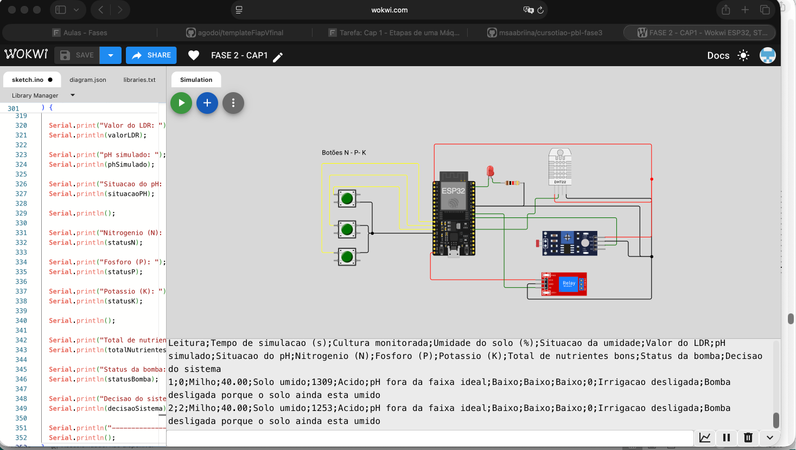
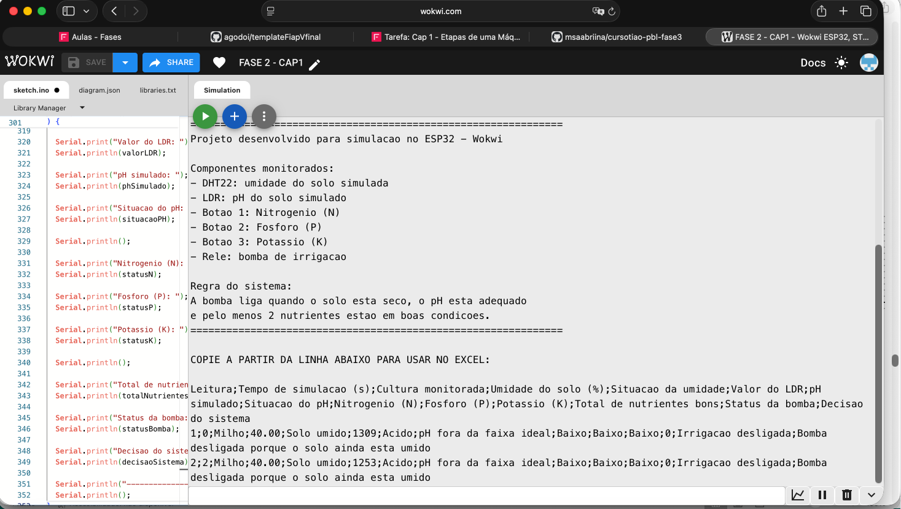
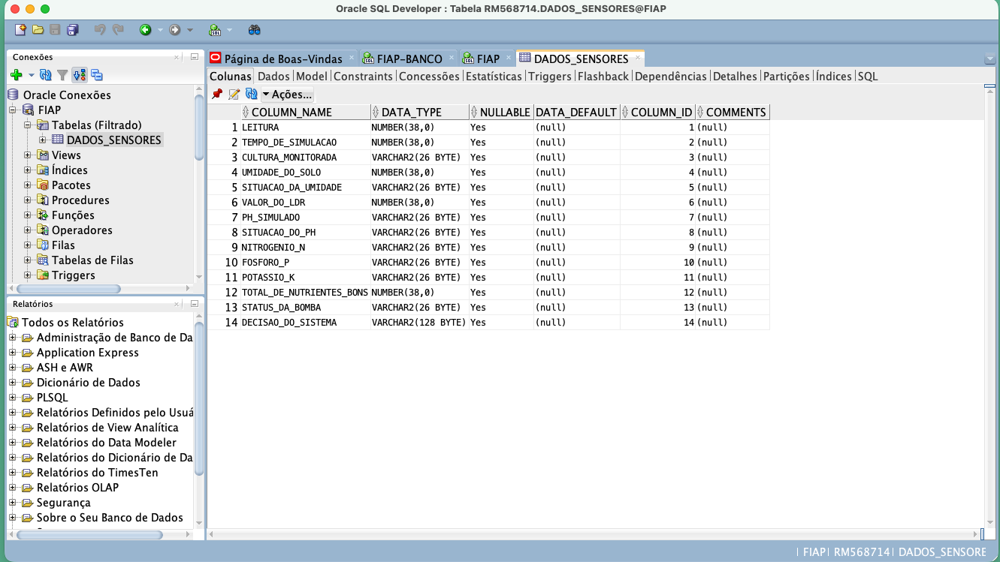
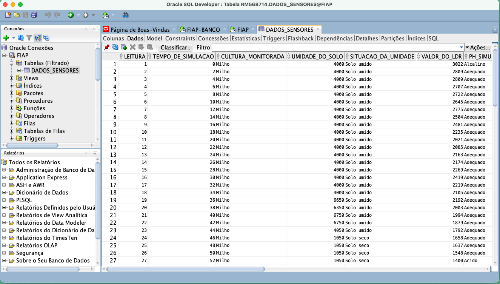
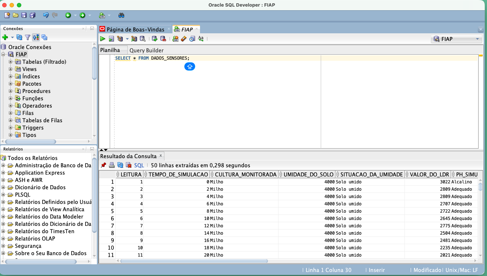
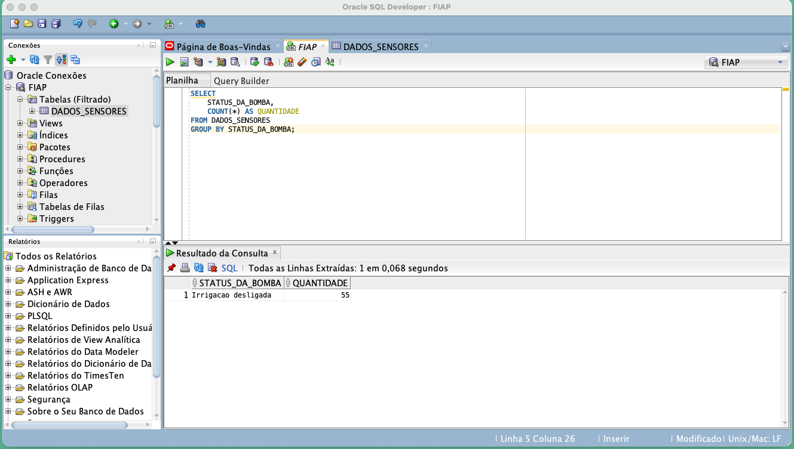

# FIAP - Faculdade de Informática e Administração Paulista

<p align="center">
  <a href="https://www.fiap.com.br/">
    
  </a>
</p>

<br>

# FarmTech Solutions - Fase 3

## Etapas de uma Máquina Agrícola: Banco de Dados com Oracle

<br>

## Nome do grupo

**FarmTech Solutions**

<br>

## 👨‍🎓 Integrantes

- Karina Garta Szewczuk  RM569309
- Maria Sabrina Feitosa da Silva  RM568714
- Nicolas Lima Apolinário  RM570741
- Roger Gabriel de Souza Jesus Costa  RM573659

<br>

## 👩‍🏫 Professores

### Tutor(a)

- Sabrina Otoni

### Coordenador(a)

- André Godói

<br>

## 📜 Descrição

Este projeto faz parte da Fase 3 do PBL da FIAP, no curso de Inteligência Artificial, dentro da proposta da startup fictícia **FarmTech Solutions**, voltada para soluções tecnológicas aplicadas ao agronegócio.

Na fase anterior, foi desenvolvido no **Wokwi** um sistema de irrigação inteligente utilizando **ESP32**, com sensores e componentes simulados para representar uma máquina agrícola voltada à cultura do **milho**. O sistema realiza a leitura da umidade do solo, do pH simulado pelo LDR, dos nutrientes NPK e, a partir dessas informações, decide se a irrigação deve ser ativada ou desligada.

Nesta Fase 3, o objetivo principal foi trabalhar com conceitos iniciais de **Banco de Dados**, carregando os dados coletados pelos sensores em um banco relacional **Oracle**. Para isso, as informações geradas no Wokwi foram organizadas em formato de tabela, exportadas como arquivo CSV e importadas no **Oracle SQL Developer** para a tabela `DADOS_SENSORES`.

A tabela criada armazena informações como número da leitura, tempo de simulação, cultura monitorada, umidade do solo, situação da umidade, valor do LDR, pH simulado, situação do pH, status dos nutrientes Nitrogênio, Fósforo e Potássio, total de nutrientes em boas condições, status da bomba e decisão final do sistema.

Depois da importação, foram realizadas consultas SQL para validar se os dados foram gravados corretamente no banco. Entre as consultas realizadas, estão a visualização geral dos registros com `SELECT * FROM DADOS_SENSORES`, a contagem dos status da bomba de irrigação, a média da umidade do solo e a filtragem de leituras em que o solo estava seco.

Dessa forma, o projeto demonstra o caminho completo dos dados: primeiro eles são gerados na simulação do Wokwi, depois organizados em um arquivo CSV, importados para o banco Oracle e, por fim, analisados por meio de consultas SQL. Essa estrutura cria uma base importante para futuras evoluções do projeto, como dashboards em Python, análises estatísticas e aplicações de inteligência artificial no agronegócio.

<br>

## 🎯 Objetivo da atividade

O objetivo desta entrega é demonstrar a importação dos dados coletados na Fase 2 para um banco de dados Oracle, documentando todo o processo realizado.

Nesta entrega, foram contemplados:

- Geração de dados no Wokwi a partir da simulação do ESP32;
- Organização das leituras em formato CSV;
- Importação do arquivo CSV no Oracle SQL Developer;
- Criação da tabela `DADOS_SENSORES`;
- Execução de consultas SQL;
- Registro dos prints das etapas realizadas;
- Organização do projeto no GitHub;
- Documentação do processo no README;
- Preparação do vídeo demonstrativo de até 5 minutos.

<br>

## 🌽 Cultura monitorada

A cultura escolhida para o projeto foi o **milho**.

A decisão da irrigação foi baseada nas seguintes condições:

- Umidade do solo;
- Situação do pH simulado;
- Presença de nutrientes NPK;
- Quantidade de nutrientes em boas condições;
- Status final da bomba de irrigação.

A lógica principal utilizada foi:

> A bomba de irrigação é ativada quando o solo está seco, o pH está adequado e pelo menos dois nutrientes estão em boas condições.

<br>

## 🔄 Fluxo da solução

O fluxo do projeto foi organizado da seguinte forma:

```text
Wokwi / ESP32
      ↓
Leitura dos sensores simulados
      ↓
Serial Monitor com dados em formato CSV
      ↓
Arquivo dados_irrigacao.csv
      ↓
Importação no Oracle SQL Developer
      ↓
Tabela DADOS_SENSORES
      ↓
Consultas SQL para validação dos dados
```

<br>

## 🧠 Diferença do código ajustado no Wokwi

Inicialmente, o código do Wokwi exibia as informações no Serial Monitor em formato descritivo, como um painel de acompanhamento.

Exemplo:

```text
Umidade do solo: 36.00%
Situação da umidade: SOLO SECO
Valor do LDR: 2529
Situação do pH: ADEQUADO
Resultado final: IRRIGAÇÃO ATIVADA
```

Esse formato era bom para leitura humana, mas não era ideal para importar os dados em uma planilha ou em um banco de dados.

Por isso, o código foi ajustado para gerar os dados em formato de tabela, utilizando separação por ponto e vírgula. Assim, cada leitura passou a representar uma linha e cada informação passou a representar uma coluna.

Exemplo:

```csv
Leitura;Tempo de simulacao (s);Cultura monitorada;Umidade do solo (%);Situacao da umidade;Valor do LDR;pH simulado;Situacao do pH;Nitrogenio (N);Fosforo (P);Potassio (K);Total de nutrientes bons;Status da bomba;Decisao do sistema
1;2;Milho;36.00;Solo seco;2529;Adequado;pH adequado;Bom;Baixo;Bom;2;Irrigacao ativada;Bomba ligada porque o solo esta seco, o pH esta adequado e ha nutrientes suficientes
```

Essa alteração facilitou a importação dos dados no Oracle SQL Developer.

<br>

## 🗃️ Banco de dados Oracle

A tabela criada no Oracle SQL Developer recebeu o nome:

```sql
DADOS_SENSORES
```

A tabela possui os seguintes campos:

| Coluna | Descrição |
|---|---|
| `LEITURA` | Número da leitura realizada |
| `TEMPO_DE_SIMULACAO` | Tempo da simulação em segundos |
| `CULTURA_MONITORADA` | Cultura analisada no projeto |
| `UMIDADE_DO_SOLO` | Umidade simulada do solo |
| `SITUACAO_DA_UMIDADE` | Indica se o solo está seco ou úmido |
| `VALOR_DO_LDR` | Valor lido pelo LDR |
| `PH_SIMULADO` | Classificação simbólica do pH |
| `SITUACAO_DO_PH` | Indica se o pH está adequado ou fora da faixa ideal |
| `NITROGENIO_N` | Situação do Nitrogênio |
| `FOSFORO_P` | Situação do Fósforo |
| `POTASSIO_K` | Situação do Potássio |
| `TOTAL_DE_NUTRIENTES_BONS` | Quantidade de nutrientes em boas condições |
| `STATUS_DA_BOMBA` | Indica se a irrigação foi ativada ou desligada |
| `DECISAO_DO_SISTEMA` | Justificativa da decisão tomada pelo sistema |

<br>

## 📊 Consultas SQL realizadas

### Consulta geral dos dados

```sql
SELECT * FROM DADOS_SENSORES;
```

Essa consulta foi utilizada para verificar todos os registros importados na tabela.

<br>

### Consulta dos principais dados da irrigação

```sql
SELECT 
    LEITURA,
    CULTURA_MONITORADA,
    UMIDADE_DO_SOLO,
    SITUACAO_DA_UMIDADE,
    STATUS_DA_BOMBA
FROM DADOS_SENSORES;
```

Essa consulta mostra as principais informações relacionadas à leitura da umidade e ao status da bomba.

<br>

### Consulta de contagem por status da bomba

```sql
SELECT 
    STATUS_DA_BOMBA,
    COUNT(*) AS QUANTIDADE
FROM DADOS_SENSORES
GROUP BY STATUS_DA_BOMBA;
```

Essa consulta permite verificar quantas vezes a bomba ficou ligada ou desligada.

<br>

### Consulta da média da umidade do solo

```sql
SELECT 
    AVG(UMIDADE_DO_SOLO) AS MEDIA_UMIDADE
FROM DADOS_SENSORES;
```

Essa consulta calcula a média da umidade do solo a partir dos registros importados.

<br>

### Consulta das leituras com solo seco

```sql
SELECT 
    LEITURA,
    UMIDADE_DO_SOLO,
    SITUACAO_DA_UMIDADE,
    VALOR_DO_LDR,
    SITUACAO_DO_PH,
    DECISAO_DO_SISTEMA
FROM DADOS_SENSORES
WHERE SITUACAO_DA_UMIDADE = 'Solo seco';
```

Essa consulta filtra as leituras em que o solo foi identificado como seco.

<br>

## 📝 Relatório do passo a passo

Além da documentação principal neste README, o projeto também possui um relatório com o passo a passo da atividade.

O relatório está disponível em:

```text
document/relatorio_fase3.md
```

Resumo do processo realizado:

1. O sistema de irrigação foi simulado no Wokwi usando ESP32.
2. O código foi ajustado para gerar as leituras em formato de tabela.
3. Os dados foram copiados do Serial Monitor.
4. As informações foram salvas no arquivo `dados_irrigacao.csv`.
5. O arquivo CSV foi importado no Oracle SQL Developer.
6. A tabela `DADOS_SENSORES` foi criada no banco Oracle.
7. Consultas SQL foram executadas para validar os dados.
8. Prints foram registrados para comprovar cada etapa.
9. O repositório foi organizado no GitHub.
10. O vídeo demonstrativo foi preparado para apresentação da entrega.

<br>

## 🖼️ Prints do projeto

### Circuito no Wokwi



<br>

### Serial Monitor com dados em formato CSV



<br>

### Arquivo CSV no VS Code


<br>

### Estrutura da tabela no Oracle SQL Developer



<br>

### Dados importados no Oracle SQL Developer



<br>

### Consulta SELECT funcionando



<br>

### Consulta por status da bomba



<br>

## 📁 Estrutura de pastas

Dentre os arquivos e pastas presentes na raiz do projeto, definem-se:

```text
.github/
assets/
config/
document/
scripts/
src/
README.md
```

### `.github`

Nesta pasta ficam os arquivos de configuração específicos do GitHub, que podem ajudar a gerenciar e automatizar processos no repositório.

Neste projeto, a pasta pode ser utilizada futuramente para configurações de workflow, issues, pull requests ou automações.

<br>

### `assets`

Nesta pasta estão os arquivos relacionados a elementos não estruturados do repositório, como imagens e prints.

Exemplos de arquivos:

```text
assets/wokwi-circuito.png
assets/serial-monitor-csv.png
assets/csv-vscode.png
assets/oracle-colunas.png
assets/oracle-dados.png
assets/select-dados-sensores.png
assets/consulta-status-bomba.png
```

<br>

### `config`

Nesta pasta ficam arquivos de configuração usados para definir parâmetros e ajustes do projeto.

Neste momento, a pasta pode ser mantida para futuras configurações do projeto.

<br>

### `document`

Nesta pasta estão os documentos do projeto solicitados durante as fases.

Exemplo:

```text
document/relatorio_fase3.md
```

Esse arquivo contém o relatório com o passo a passo da atividade, explicando como os dados foram gerados, organizados, importados e consultados no banco Oracle.

<br>

### `scripts`

Nesta pasta ficam scripts auxiliares e comandos utilizados no projeto.

Exemplos:

```text
scripts/consultas_sql.sql
scripts/criar_tabela.sql
```

O arquivo `consultas_sql.sql` contém as consultas executadas no Oracle SQL Developer.

<br>

### `src`

Nesta pasta fica todo o código-fonte criado para o desenvolvimento do projeto.

Exemplos:

```text
src/codigo_wokwi.ino
src/diagram.json
src/dados_irrigacao.csv
```

Descrição dos arquivos:

| Arquivo | Descrição |
|---|---|
| `codigo_wokwi.ino` | Código do ESP32 utilizado na simulação do Wokwi |
| `diagram.json` | Arquivo de montagem do circuito no Wokwi |
| `dados_irrigacao.csv` | Arquivo com os dados exportados do Serial Monitor |
| `importar_csv_oracle.py` | Script opcional em Python para leitura do CSV e envio ao Oracle |

<br>

### `README.md`

Arquivo que serve como guia e explicação geral sobre o projeto.

<br>

## 🔧 Como executar o código

### Pré-requisitos

Para executar e validar este projeto, foram utilizadas as seguintes ferramentas:

- Wokwi;
- ESP32 DevKitC V4;
- Arduino/C++ no ambiente do Wokwi;
- Oracle SQL Developer;
- Banco de dados Oracle da FIAP;
- Visual Studio Code;
- Git e GitHub;
- Arquivo CSV para importação dos dados.

<br>

### 1. Executar a simulação no Wokwi

1. Acesse o projeto no Wokwi.
2. Abra o arquivo com o código do ESP32.
3. Confirme se o circuito está configurado com:
   - ESP32 DevKitC V4;
   - DHT22;
   - LDR;
   - Botões para NPK;
   - Relé;
   - LED indicador.
4. Clique em **Start Simulation**.
5. Abra o **Serial Monitor**.
6. Aguarde as leituras serem geradas.
7. Copie os dados em formato CSV.

<br>

### 2. Gerar o arquivo CSV

1. Abra o VS Code.
2. Crie ou abra o arquivo:

```text
src/dados_irrigacao.csv
```

3. Cole os dados copiados do Serial Monitor.
4. Salve o arquivo.

<br>

### 3. Importar os dados no Oracle SQL Developer

1. Abra o Oracle SQL Developer.
2. Conecte-se ao banco Oracle da FIAP.
3. Clique com o botão direito em **Tabelas (Filtrado)**.
4. Selecione **Importar Dados**.
5. Escolha o arquivo `dados_irrigacao.csv`.
6. Avance nas etapas de importação.
7. Defina o nome da tabela como:

```text
DADOS_SENSORES
```

8. Finalize a importação.
9. Confirme se os dados foram carregados.

<br>

### 4. Executar as consultas SQL

No Oracle SQL Developer, execute:

```sql
SELECT * FROM DADOS_SENSORES;
```

Também podem ser executadas as consultas presentes no arquivo:

```text
scripts/consultas_sql.sql
```

<br>

### 5. Atualizar o GitHub

Depois de alterar arquivos, adicionar prints ou atualizar o README, execute no terminal:

```bash
git add .
git commit -m "Atualiza entrega da fase 3"
git push
```

<br>

## 🎥 Vídeo demonstrativo

O vídeo demonstrativo apresenta:

- Organização do repositório no GitHub;
- Simulação no Wokwi;
- Geração dos dados no Serial Monitor;
- Arquivo CSV utilizado;
- Importação no Oracle SQL Developer;
- Consultas SQL executadas;
- Validação dos dados no banco.

Link do vídeo:

```text
INSERIR_LINK_DO_YOUTUBE_AQUI
```

<br>

## 🗃️ Histórico de lançamentos

### 0.5.0 - 19/05/2026

- Finalização do README no padrão FIAP;
- Inclusão dos prints do Oracle SQL Developer;
- Inclusão das consultas SQL;
- Organização final das pastas do projeto;
- Preparação para entrega da Fase 3.

### 0.4.0 - 19/05/2026

- Importação dos dados no Oracle SQL Developer;
- Criação da tabela `DADOS_SENSORES`;
- Execução da consulta `SELECT * FROM DADOS_SENSORES`.

### 0.3.0 - 19/05/2026

- Organização dos dados gerados no Wokwi em formato CSV;
- Criação do arquivo `dados_irrigacao.csv`.

### 0.2.0 - 19/05/2026

- Ajuste do código do Wokwi para impressão dos dados em formato de tabela;
- Padronização dos campos para importação no banco.

### 0.1.0 - 19/05/2026

- Estrutura inicial do projeto;
- Simulação do sistema de irrigação inteligente no Wokwi.

<br>

## 📋 Licença

Este projeto segue o modelo acadêmico da FIAP e foi desenvolvido exclusivamente para fins educacionais.

MODELO GIT FIAP por FIAP está licenciado sob Attribution 4.0 International..